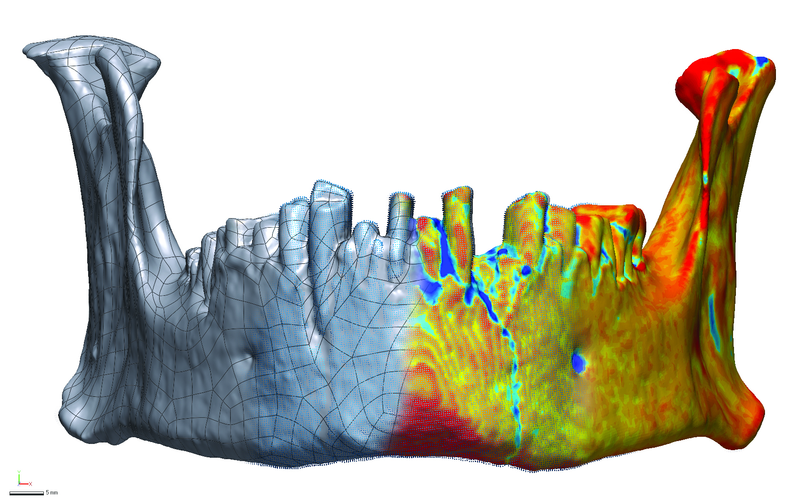

# cai.mandible

Considerations for post-processing parameters in mixed-method 3-D analyses: A mandibular case study

_Abstract_

The production of three-dimensional (3-D) digital meshes of surface and computed tomographic (CT) data has become widespread in morphometric analyses of anthropological and archaeological data. Given that processing methods are not standardised, this leaves questions regarding the comparability of processed and digitally curated 3-D datasets. The goal of this study was to identify those processing parameters that result in the most consistent fit between CT-derived meshes and a 3-D surface model of the same human mandible. Eight meshes, each using unique thresholding and smoothing parameters, were compared to assess whole-object deviations, deviations along curves, and deviations between specific anatomical features on the surface model when compared with each of the CT scans using a suite of _comparison points_. Based on the calculated gap distances, although not the most biologically accurate, the mesh thresholded at "0" with an applied smoothing technique was found to deviate least from the surface model. Results have implications for aggregated studies that employ multi-modal 3-D datasets, and caution is recommended for studies that enlist 3-D data from websites and digital repositories, particularly if processing parameters are unknown or derived for studies with different research foci.